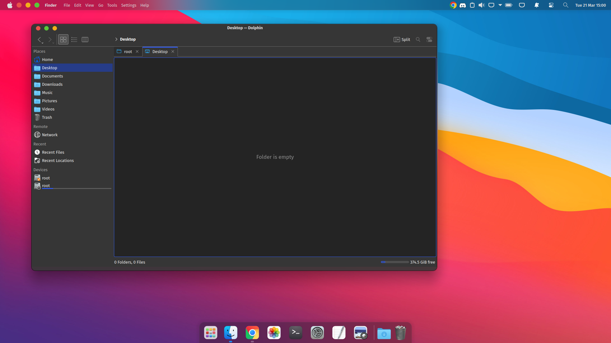

# Fully Macintosh Themed linux      
Download - https://www.mediafire.com/file/phbo85jg7m9tafd/macos.iso/file     
   
Download - 
BUILD USING `buildiso -f -p dr460nized-gaming`     

 Contains Mac themed: Desktop(KDE), bootloader(GRUB), LOGIN (SDDM) , Loading(Plymouth)      
 +About page shows macos BigSur      
 
ISO MADE USING buildiso using garuda.       
the only modified version is dr460nized-gaming.          

Any updated ISOs would not be provided. This is based on garuda and will be updated from garuda's repositories.
.        .      
.        .      
.        .      
.        .      
.        .      
.        .      
.        .      
.        .      
.        .      
.        .      
.        .      
.        .      
.        .      
.        .      
.        .      
.        .      
.        .      
.        .      
.        .      
.        .      
.        .      
.        .      
.        .      
.        .      
.        .      
.        .      
.        .      
.        .      
.        .      
.        .      
.        .      
.        .      
.        .      
.        .      
.        .      
.        .      
.        .      
.        .      
.        .      
.        .      
.        .      
.        .      
.        .      
.        .      
.        .      
.        .      
.        .      
.        .      
.        .      
.        .      
.        .      
.        .      
.        .      
.        .      
.        .      
.        .      
.        .      
.        .      
.        .      
.        .      
.        .      
.        .      
.        .      
.        .      
.        .      
.        .      
.        .      
.        .      
.        .      
.        .      
.        .      
.        .      
.        .      
.        .      
.        .      
.        .      
.        .      
.        .      
.        .      
.        .      
.        .      
.        .      
.        .      
.        .      
.        .      
.        .      
.        .      
.        .      
.        .      
.        .      
.        .      
.        .      
.        .      
.        .      
.        .      
.        .      
.        .      
.        .      
.        .      
.        .      
.        .      
.        .      
.        .      
.        .   
.        .      
.        .      
.        .      
.        .      
.        .      
.        .      
.        .      
.        .      
.        .      
.        .      
.        .      
.        .      
.        .      
.        .      
.        .      
.        .      
.        .      
.        .      
.        .      
.        .      
.        .      
.        .      
.        .      
.        .      
.        .      
.        .      
.        .      
.        .      
.        .      
.        .      
.        .      
.        .      
.        .      
.        .      
.        .      
.        .      
.        .      
.        .      
.        .      
.        .      
.        .      
.        .      
.        .      
.        .      
.        .      
.        .      
.        .      
.        .      
.        .      
.        .      
.        .      
.        .   
.        .      
.        .      
.        .      
.        .      
.        .      
.        .      
.        .      
.        .      
.        .      
.        .      
.        .      
.        .      
.        .      
.        .      
.        .      
.        .      
.        .      
.        .      
.        .      
.        .      
.        .      
.        .      
.        .      
.        .      
.        .      
.        .      
.        .      
.        .      
.        .      
.        .      
.        .      
.        .      
.        .      
.        .      
.        .      
.        .      
.        .      
.        .      
.        .      
.        .      
.        .      
.        .      
.        .      
.        .      
.        .      
.        .      
.        .      
.        .      
.        .      
.        .      
.        .      
.        .   
.        .      
.        .      
.        .      
.        .      
.        .      
.        .      
.        .      
.        .      
.        .      
.        .      
.        .      
.        .      
.        .      
.        .      
.        .      
.        .      
.        .      
.        .      
.        .      
.        .      
.        .      
.        .      
.        .      
.        .      
.        .      
.        .      
.        .      
.        .      
.        .      
.        .      
.        .      
.        .      
.        .      
.        .      
.        .      
.        .      
.        .      
.        .      
.        .      
.        .      
.        .      
.        .      
.        .      
.        .      
.        .      
.        .      
.        .      
.        .      
.        .      
.        .      
.        .      
.        .   
.        .      
.        .      
.        .      
.        .      
.        .      
.        .      
.        .      
.        .      
.        .      
.        .      
.        .      
.        .      
.        .      
.        .      
.        .      
.        .      
.        .      
.        .      
.        .      
.        .      
.        .      
.        .      
.        .      
.        .      
.        .      
.        .      
.        .      
.        .      
.        .      
.        .      
.        .      
.        .      
.        .      
.        .      
.        .      
.        .      
.        .      
.        .      
.        .      
.        .      
.        .      
.        .      
.        .      
.        .      
.        .      
.        .      
.        .      
.        .      
.        .      
.        .      
.        .      
.        .   
.        .      
.        .      
.        .      
.        .      
.        .      
.        .      
.        .      
.        .      
.        .      
.        .      
.        .      
.        .      
.        .      
.        .      
.        .      
.        .      
.        .      
.        .      
.        .      
.        .      
.        .      
.        .      
.        .      
.        .      
.        .      
.        .      
.        .      
.        .      
.        .      
.        .      
.        .      
.        .      
.        .      
.        .      
.        .      
.        .      
.        .      
.        .      
.        .      
.        .      
.        .      
.        .      
.        .      
.        .      
.        .      
.        .      
.        .      
.        .      
.        .      
.        .      
.        .      
.        .   
.        .      
.        .      
.        .      
.        .      
.        .      
.        .      
.        .      
.        .      
.        .      
.        .      
.        .      
.        .      
.        .      
.        .      
.        .      
.        .      
.        .      
.        .      
.        .      
.        .      
.        .      
.        .      
.        .      
.        .      
.        .      
.        .      
.        .      
.        .      
.        .      
.        .      
.        .      
.        .      
.        .      
.        .      
.        .      
.        .      
.        .      
.        .      
.        .      
.        .      
.        .      
.        .      
.        .      
.        .      
.        .      
.        .      
.        .      
.        .      
.        .      
.        .      
.        .      
.        .   
.        .      
.        .      
.        .      
.        .      
.        .      
.        .      
.        .      
.        .      
.        .      
.        .      
.        .      
.        .      
.        .      
.        .      
.        .      
.        .      
.        .      
.        .      
.        .      
.        .      
.        .      
.        .      
.        .      
.        .      
.        .      
.        .      
.        .      
.        .      
.        .      
.        .      
.        .      
.        .      
.        .      
.        .      
.        .      
.        .      
.        .      
.        .      
.        .      
.        .      
.        .      
.        .      
.        .      
.        .      
.        .      
.        .      
.        .      
.        .      
.        .      
.        .      
.        .      
.        .   
.        .      
.        .      
.        .      
.        .      
.        .      
.        .      
.        .      
.        .      
.        .      
.        .      
.        .      
.        .      
.        .      
.        .      
.        .      
.        .      
.        .      
.        .      
.        .      
.        .      
.        .      
.        .      
.        .      
.        .      
.        .      
.        .      
.        .      
.        .      
.        .      
.        .      
.        .      
.        .      
.        .      
.        .      
.        .      
.        .      
.        .      
.        .      
.        .      
.        .      
.        .      
.        .      
.        .      
.        .      
.        .      
.        .      
.        .      
.        .      
.        .      
.        .      
.        .      
.        .   
.        .      
.        .      
.        .      
.        .      
.        .      
.        .      
.        .      
.        .      
.        .      
.        .      
.        .      
.        .      
.        .      
.        .      
.        .      
.        .      
.        .      
.        .      
.        .      
.        .      
.        .      
.        .      
.        .      
.        .      
.        .      
.        .      
.        .      
.        .      
.        .      
.        .      
.        .      
.        .      
.        .      
.        .      
.        .      
.        .      
.        .      
.        .      
.        .      
.        .      
.        .      
.        .      
.        .      
.        .      
.        .      
.        .      
.        .      
.        .      
.        .      
.        .      
.        .      
.        .   
.        .      
.        .      
.        .      
.        .      
.        .      
.        .      
.        .      
.        .      
.        .      
.        .      
.        .      
.        .      
.        .      
.        .      
.        .      
.        .      
.        .      
.        .      
.        .      
.        .      
.        .      
.        .      
.        .      
.        .      
.        .      
.        .      
.        .      
.        .      
.        .      
.        .      
.        .      
.        .      
.        .      
.        .      
.        .      
.        .      
.        .      
.        .      
.        .      
.        .      
.        .      
.        .      
.        .      
.        .      
.        .      
.        .      
.        .      
.        .      
.        .      
.        .      
.        .      
.        .   
.        .      
.        .      
.        .      
.        .      
.        .      
.        .      
.        .      
.        .      
.        .      
.        .      
.        .      
.        .      
.        .      
.        .      
.        .      
.        .      
.        .      
.        .      
.        .      
.        .      
.        .      
.        .      
.        .      
.        .      
.        .      
.        .      
.        .      
.        .      
.        .      
.        .      
.        .      
.        .      
.        .      
.        .      
.        .      
.        .      
.        .      
.        .      
.        .      
.        .      
.        .      
.        .      
.        .      
.        .      
.        .      
.        .      
.        .      
.        .      
.        .      
.        .      
.        .      
.        .   

This is to be used on apple hardware only!!!!         
